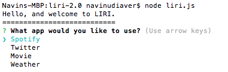
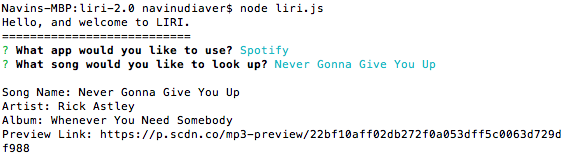

<h1>The LIRI Node Application. </h1>

This is a personal Node application I built that utilizes many different Node packages in order to interact with me. The Node packages used include Twitter, Weather-JS, Inquirer, Spotify, Request and FS. 

<h3>How it works: </h3>

 

The LIRI UI was directly developed from the inquirer node package. Upon initialization, I am given four options to choose from: Spotify, Twitter, Movie and Weather.

<h3>Spotify: </h3>

The first option is to use the Spotify application. Once this option is chosen, I am asked to input a song title to research. The application then utilizes the Spotify Node Package in order to retrieve song, artist and album information as well as a Spotify preview link.

<h3>Twitter: </h3>
<h3>Weather-JS: </h3>
<h3>Request Package and OMDB: </h3>
<h3>FS Package and Logging: </h3>