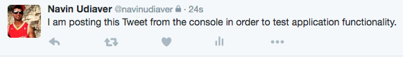

<h1>The LIRI 2.0 Node Application. </h1>

LIRI 1.0 was a Node application I was assigned to create during my time at the UT Austin Coding Bootcamp. It's purpose was to receive one line of command from the console and regurgitate information regarding either songs, movies or tweets. However, I decided to make some improvements in the functionality and interface by learning and incorporating Node packages outside of the scope of the original assignment. The Node packages utilized in LIRI 2.0 include Twitter, Weather-JS, Inquirer, Spotify, Request and FS.

<h3>Improvements and Functions: </h3>
 

The first set of improvements I made from the original assignment was with the user interface of the application. While the original LIRI assignment interpreted what I wanted based off of process.argv commands, this LIRI UI was directly developed from the inquirer node package. Upon initialization, I am given four options to choose from: Spotify, Twitter, Movie and Weather.

 

 

<h3>Spotify: </h3>
 

The first option is to invoke the Spotify application. Once this option is chosen, I am asked to input a song title to research. The application then utilizes the Spotify Node Package in order to retrieve song, artist and album information as well as a Spotify preview link.

 

<h3>Twitter: </h3>
 

The second option is the Twitter application. While the original assignment was to retrieve the most recent 10 tweets from my profile, I decided to go a different route with Twitter in this version. I have programmed a post route that now allows me to post any Tweet I want directly from the console! This is a feature that I actively researched the Twitter Node Package documentation for and is probably my favorite function of the entire app. 

 

 

<h3>Weather-JS: </h3>
 

Weather-JS was also not a part of the original LIRI assignment. I really wanted to add it as an application feature as it was the first Node package I had learned to successfully install and dissect. Seeing how simple it was to pull such useful information such as weather sparked a passion to continue learning and studying the back end of web development. With Weather-JS, the user inputs a zip code and the package returns weather information for that zip code on that particular day.

 

 

<h3>Request Package and OMDB: </h3>
 

When the movie option is chosen, I am prompted to submit a movie title to research. This aspect of the application uses the node request package in order to return actor, plot and release date information online from the OMDB website. While this option is largely the same from the original application, I once again used inquirer to improve the UI of the application.

 

 

<h3>FS Package and Logging: </h3>
 

Using the fs package, I log all actions performed by the user into a log.txt file. This is to track what the application is used for as well as to store data that I have researched in the past. 

 

 

